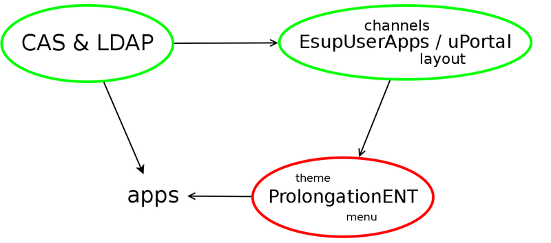
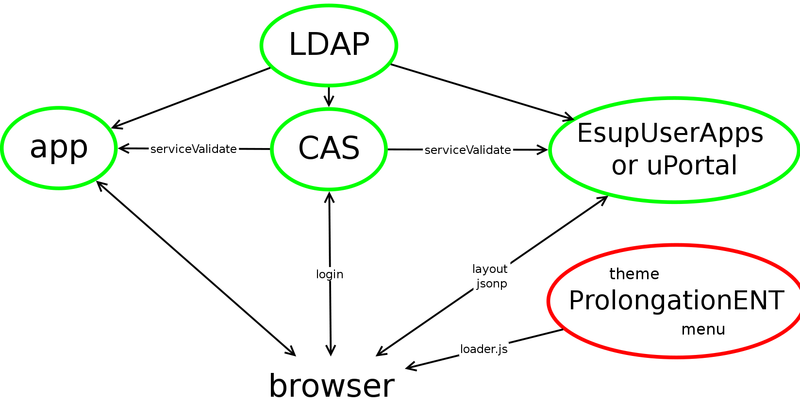

ProlongationENT
===========

Web widget prolonging uportal/ENT into apps

* [Introduction](#introduction)
* [Configuration](#configuration)
* [Application integration](#application-integration)
* [Theme](#theme)
* [Technical details](#technical-details)


Introduction
------------

ProlongationENT relies on EsupUserApps or uPortal to know which applications are allowed.
It will render this information with a menu, a list or whatever you want.

### Slides

[ProlongationENT et uPortal](http://prigaux.github.io/ProlongationENT-et-uPortal/#/3) (in french)

### Diagrams

This diagram shows the links between the different components:

[](docs/diagram.svg)

And here is a more complete workflow:

[](docs/workflow.svg)


Configuration
-------------

* create ```src/main/webapp/WEB-INF/config.json``` similar to ```config-example.json```
* deploy using ```mvn package```
* test the result with ```https://ent.univ.fr/ProlongationENT/test/#/test/layout.jsonp``` then ```https://ent.univ.fr/ProlongationENT/test/```

### with EsupUserApps web service

[ESupUserApps](https://github.com/EsupPortail/EsupUserApps) is a simple java application which computes users's layout (channels, apps).

To use EsupUserApps, configure ProlongationENT ```layout_url``` in config.json:
```js
   "layout_url": "https://ent.univ.fr/EsupUserApps/layout",
```

### with uPortal4 web service

You can use uPortal to compute user's layout (channels, apps).

You must [install a JSP in uPortal's webapp directory](utils/uportal4/README.md)

Then configure ```layout_url``` in config.json:
```js
   "layout_url": "https://ent.univ.fr/uPortal/layout.jsp",
```

### reverse proxy caching

It is recommanded to use apache (or nginx or ...) to cache loader.js since it is a single point of failure.
In apache, using:

```apache
CacheEnable disk /ProlongationENT
```

will ensure the latest cached version when the servlet is down.


Application integration
-------------

Simply add the following to applications:

```html
<script> window.prolongation_ENT_args = { current: 'xxx' } </script>
<script src="https://ent.univ.fr/ProlongationENT/loader.js"></script>
```

You can do it using apache:

```apache
RequestHeader unset  Accept-Encoding
AddOutputFilterByType SUBSTITUTE text/html
Substitute "s|<body>|<body> <script>window.prolongation_ENT_args = { current: 'xxx' }; </script><script src='https://ent.univ.fr/ProlongationENT/loader.js'></script>|"
```

### ```window.prolongation_ENT_args``` options

* current, currentAppIds
* no_titlebar
* hide_menu
* logout: CSS selector used to find the logout button. bandeau's logout will trigger a click on app's logout button
* logout_href: url to go to for logout (sometimes easier to use than a CSS selector)
* login: CSS selector used to find the login button. Used to detect if bandeau must be displayed. See also `is_logged` below.
* is_logged: 
  * CSS selector or boolean used to detect if bandeau must be displayed
  * used when option `login` is unset
  * default value is option `logout` value
  * if `login`/`logout`/`is_logged` are all unset, bandeau will always by displayed
* ping_to_increase_session_timeout
* quirks
* onload

NB: for the full list, see ```interface prolongation_ENT_args``` in ```lib/defs.d.ts```

### Suggestions to avoid flash when loading bandeau on page

The best is:
* put `loader.js` in the page only if the user is logged in the application (easy if the application is always connected)
* you can then use `is_logged: true`
* avoid `extra_css`: put `<style>` or `<link type="text/css" ...>` only if the user is logged in the application
* put `loader.js` immediatly after `<body>`: if the bandeau is cached (in localStorage, the default behaviour), it can be displayed immediatly before anything else

If you can't add `loader.js` only if the user is logged in the application:
* put loader.js after the logout HTML elt
* use `logout` or `is_logged`


Theme
-------------------

Themes are composed of CSS, images, HTML templates (cf ```webapp/theme-simple```) and javascript (cf ```webapp/lib/theme-simple.js```).

If you write a new theme, or need help writing it, please contact Pascal Rigaux or esup-utilisateurs@esup-portail.org (french list).


Technical details
-------------------

NB: ProlongationENT is mostly javascript/HTML/CSS. The java code is small and could be replaced by [webpack](https://webpack.github.io/) or [browserify](http://browserify.org/).

### all urls

#### ```/loader.js```

Combines configuration, CSS, templates and javascript code.
If a cached layout is found in ```sessionStorage```, it will use it.
Otherwise it loads it (layout_url).

A neat feature is "background" update: the sessionStorage layout is used, but if it is old, an updated version is requested from server and the bandeau is updated if there is a change.

#### ```/purgeCache```

The configuration files and ```/loader.js``` are computed on startup (or webapp reload). If you modify a file, call ```/purgeCache``` to take changes into account (when debugging, you can use config option ```disableServerCache```)
